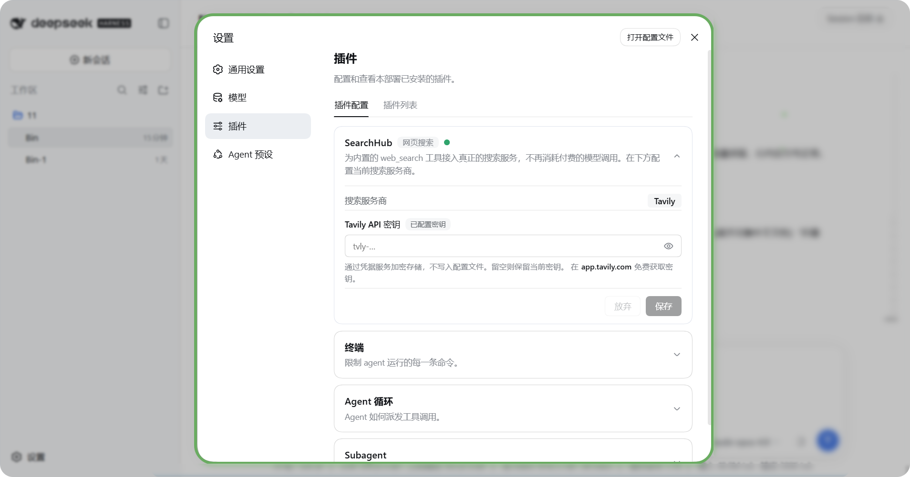
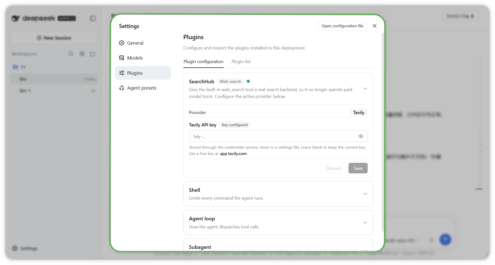

# 🔍 dsh-searchhub

<details>
<summary><b>🇨🇳 中文说明（点击展开完整中文文档）</b></summary>

<br>

### 别再为 Agent 的联网搜索花钱了

**dsh-searchhub** 是给 [DeepSeek Harness (DSH)](https://github.com/deepseek-ai/deepseek-harness) 用的**可插拔搜索中枢**。它让你的 Agent 通过市面主流、即插即用的搜索服务商（挂在 DSH 的 web 能力接缝 `ctx.web` 后面）来联网搜索，而**不用每次 `web_search` 都消耗付费的 DeepSeek 模型调用**。

> 💸 **不用再为搜索付费。** 把内置的 `web_search` 工具接到真正的搜索 API，把模型预算留给真正的思考。
>
> 🧩 **可插拔设计。** 一个中枢，多家服务商。目前内置 **Tavily**；架构从一开始就为后续接入更多主流搜索引擎而设计——挑你喜欢的，随时替换。
>
> 🎁 **免费起步。** Tavily 每月赠送 **1000 个免费额度**，无需信用卡即可开始，日常 Agent 检索完全够用。
>
> ✨ **做得精美。** 不是一个干巴巴的配置开关——dsh-searchhub 自带**手工打造的原生设置卡片**：可折叠、带实时三态状态圆点、真正的显示/隐藏眼睛按钮、即时的密钥格式校验，以及一个可点击的取密钥链接。它看起来就像产品自带的功能，因为它就是照着这个标准做的。

#### 📸 原生设置卡片

这是它在 **设置 → 插件** 里**自带**的精美卡片——实时状态圆点、真正的显示/隐藏按钮、行内格式校验，看起来就像产品原生功能。界面语言切到中文时，卡片文案**全中文**（对比上方英文效果，绝不混杂）：

<p align="center">
  
</p>

---

#### ✨ 功能亮点

- 🔌 **可插拔搜索中枢** —— 干净的 provider 接缝，主流搜索引擎都能挂到 `ctx.web` 后面。**目前内置 Tavily**，并预留扩展空间。
- 💰 **零模型调用成本** —— 替换内置的 `web-search-deepseek` provider，让 `web_search` 打到真正的搜索 API，而不是一次付费模型调用。
- 🎨 **自带精美原生卡片** —— 在 **设置 → 插件 → 插件配置** 里作为独立、可折叠的卡片出现（端点、搜索深度、结果数、答案开关、API 密钥），带实时状态圆点、眼睛按钮、行内密钥格式校验。
- 🔐 **密钥处理得当** —— API 密钥作为**凭据引用**存储（默认 `TAVILY_API_KEY`），从界面或环境变量录入，永远不必写进配置文件。
- ⚡ **一条命令安装** —— 以 **dsh bundle** 形式发布，`npx @wilson.liu.cn/dsh-searchhub install` 会用 **npm**（不需要 pnpm）装包并把本包写进 `dsh.profile.bundles`，无需手改 profile 的 patch 文件。
- 🧭 **结果归一化** —— 把 provider 结果映射成接缝已认识的 `{ sources, truncated }` 结构。

#### 🚀 安装

**方式 A —— 从 npm 安装（推荐，不需要 pnpm）**

```bash
npx @wilson.liu.cn/dsh-searchhub install --profile web
```

这条命令从 **npm registry** 下载本包（[`@wilson.liu.cn/dsh-searchhub`](https://www.npmjs.com/package/@wilson.liu.cn/dsh-searchhub)）并自动完成「安装 + 激活」。想只用 npm 手动装，见下方**方式 B**。

从本仓库 checkout 直接装（开发本插件时用，不经过 npm）：

```bash
node scripts/cli.mjs install
```

这一步会做三件事（就是 `dsh plugin` 的三步，但只用 npm）：

1. `$DSH_HOME/profiles/web` 不存在时，按 DSH 自己的模板初始化（`package.json` + `cordis.patch.yml` + `pnpm-workspace.yaml`）；
2. 在该目录里用 **npm** 安装本插件；
3. 把本包追加进 profile 的 `dsh.profile.bundles` 层列表，于是它的 `cordis.patch.yml`（把 `ctx.web` 切到 Tavily、禁用 `web-search-deepseek`、注册本插件的宿主端 + 浏览器端）在下次启动时生效。

常用子命令：

```bash
npx @wilson.liu.cn/dsh-searchhub status               # 是否已安装 / 是否已激活 / 密钥是否配置
npx @wilson.liu.cn/dsh-searchhub install --dry-run    # 只打印计划，不做任何改动
npx @wilson.liu.cn/dsh-searchhub uninstall            # 卸载，并自动从 bundles 里摘掉
npx @wilson.liu.cn/dsh-searchhub install --spec github:Bin-top1/dsh-searchhub
npx @wilson.liu.cn/dsh-searchhub install --spec /path/to/dsh-searchhub   # 本地 checkout：自动打包成 tarball 再装
```

然后重启 web profile（`dsh web` 或 `dsh --profile web`），打开 **设置 → 插件**，在 **SearchHub** 卡片里填入密钥（或导出 `TAVILY_API_KEY`）。

> **为什么不用 `dsh plugin add`？** `dsh plugin` 是 pnpm 的转发器（内部 `spawnSync("pnpm", …)`），机器上没有 pnpm 会直接失败。本安装器用你手上的 npm 完成同样的三步。
>
> **为什么 `--spec` 指向目录时先打包？** npm 对本地目录会建**软链接**，而软链接包的 `@deepseek-ai/*` 依赖会从仓库真实路径解析——那里没有宿主提供的这些包（或只有一份重复的），插件会加载失败。先打包成 tarball 再把副本装进 profile，依赖就会从 profile 向上走到 DSH 安装自己的依赖闭包，不会出现重复实例。

**方式 B —— 手动 npm 安装 + 一行 bundles**

```bash
cd "$DSH_HOME/profiles/web"
npm install @wilson.liu.cn/dsh-searchhub
```

然后把包名加进该 profile 的 `dsh.profile.bundles`（DSH 就是靠这个列表装配插件层的）：

```json
"dsh": {
  "profile": {
    "bundles": ["@deepseek-ai/dsh-base", "@deepseek-ai/dsh-web-app", "@wilson.liu.cn/dsh-searchhub"]
  }
}
```

**方式 C —— 直接用 `dsh plugin`（需要 `pnpm` 在 `PATH` 上）**

```bash
dsh plugin --profile web add @wilson.liu.cn/dsh-searchhub
```

**方式 D —— 纯手工 patch（不写 bundles 列表也能生效）**

```yaml
# $DSH_HOME/profiles/web/cordis.patch.yml
- id: web
  config:
    searchProvider: tavily
    fetchProvider: http
- id: web-search-deepseek
  disabled: true
- insert:
    - id: searchhub
      name: "@wilson.liu.cn/dsh-searchhub"
```

> ⚠️ 不要写 `name: "file:///…/dsh-searchhub/lib/index.js"` 去直接引用仓库里的文件：插件加载时会从仓库真实路径去找宿主提供的 `@deepseek-ai/*` 包，实测会 `ERR_MODULE_NOT_FOUND`。要用本地 checkout，请用方式 A 的 `--spec <checkout>`（先打包再安装）。

#### ⚙️ 配置项

| 键 | 类型 | 默认值 | 说明 |
| --- | --- | --- | --- |
| `apiKey` | secret 字符串 | - | 明文密钥（建议改用 `apiKeyEnv`）。 |
| `apiKeyEnv` | 凭据引用 | `TAVILY_API_KEY` | 密钥存储所用的环境变量名。 |
| `baseURL` | 字符串 | `https://api.tavily.com` | Tavily API 基址；会追加 `/search`。 |
| `searchDepth` | `basic` \| `advanced` | `basic` | 越深消耗 Tavily 额度越多。 |
| `maxResults` | 数字 (1-20) | `5` | 每次查询请求的结果数。 |
| `includeAnswer` | 布尔 | `false` | 是否让 Tavily 附带生成式答案。 |

**设置 API 密钥**（三选一）：1) **原生设置卡片**——在 **设置 → 插件 → 插件配置** 的 **SearchHub** 卡片里粘贴密钥，经凭据服务加密存储；2) **环境变量**——启动 DSH 前导出 `TAVILY_API_KEY`；3) **明文配置**——直接设 `apiKey`（不推荐）。在 <https://app.tavily.com/> 免费获取密钥与每月 1000 额度。

#### 🌏 界面语言

设置卡片自带 **英文 / 中文** 两套完整文案，跟随 DSH 的界面语言自动切换——界面是中文就全中文、是英文就全英文，绝不中英混杂。

#### 🛠️ 从源码构建

仓库已附带预构建的 `lib/index.js`（宿主端）与 `lib/client.js`（浏览器端），**安装和使用都不需要构建**：npm 只发布 `lib/*.js`、`scripts/cli.mjs`、`cordis.patch.yml` 与文档。

只有维护者需要跑构建（生成类型声明）：

```bash
npm install     # 仅 typescript 与宿主类型包，都是 devDependencies
npm run build   # tsc -p tsconfig.json → lib/types/*.d.ts
npm test        # 安装器行为 + 打包不变量测试
```

宿主端类型源码在 `src/types/`，`npm run build` 产出 `.d.ts`（`npm publish` 前由 `prepublishOnly` 自动执行）；浏览器端 `lib/client.js` 是唯一权威手写源，按 DSH 客户端模块扫描器所需的注册形式编写（React 与 JSX runtime 由宿主种子经 `require` 提供），无需打包器，也没有一份会漂移的 `.ts` 副本。

#### 🗺️ 路线图

dsh-searchhub 是一个**中枢**，而不是绑死单一引擎的壳子。Tavily 只是第一个 provider；接缝刻意做得通用，因此更多主流搜索后端都能挂到**同一张卡片**、走**同一套 ctx.web 契约**接入。欢迎贡献新的 provider。

---

> 以下为英文完整文档。

</details>

### Stop paying for your agent's web search.

**dsh-searchhub** is a pluggable **search hub** for the
[DeepSeek Harness (DSH)](https://github.com/deepseek-ai/deepseek-harness). It
lets your agent search the web through mainstream, drop-in search providers
behind the DSH web capability seam (`ctx.web`) — instead of burning paid
DeepSeek model turns on every `web_search` call.

> 💸 **No more paying for search.** Point the agent's built-in `web_search`
> tool at a real search API and keep your model spend for actual thinking.
>
> 🧩 **Pluggable by design.** One hub, many providers. Today it ships with
> **Tavily**; the architecture is built to add more of the market's popular
> search engines over time — pick the one you like and swap it in.
>
> 🎁 **Free to start.** Tavily gives you **1,000 free credits every month** — no
> credit card to get going. Plenty for everyday agent research.
>
> ✨ **Beautifully polished.** Unlike a bare config toggle, dsh-searchhub ships
> its **own** hand-crafted native Settings card — collapsible, with a live
> tri-state status dot, a real show/hide eye toggle, instant key-format
> validation, and a proper clickable link to grab your key. It looks like it
> belongs in the product, because it was built to.

#### 📸 The native Settings card

Its **own** polished card under **Settings → Plugins**, with a live status dot, a real show/hide toggle, and inline validation — it looks like it belongs in the product:

<p align="center">
  
</p>

---

## ✨ Features

- 🔌 **Pluggable search hub** — a clean provider seam so mainstream search
  engines can be swapped in behind `ctx.web`. **Tavily is included today**, with
  room to grow.
- 💰 **Zero model-turn cost** — replaces the built-in `web-search-deepseek`
  provider, so `web_search` hits a real search API, not a paid model turn.
- 🎨 **Its own polished native card** — appears under **Settings → Plugins →
  Plugin configuration** as a dedicated, collapsible card (endpoint, search
  depth, max results, answer toggle, API key) with a live status dot, eye
  toggle, and inline key-format check.
- 🔐 **Secrets done right** — the API key lives as a **credential reference**
  (`TAVILY_API_KEY` by default), entered from the UI or the environment; it never
  has to sit in a config file.
- ⚡ **One-command install** — ships as a **dsh bundle**, so
  `npx @wilson.liu.cn/dsh-searchhub install` installs it with **npm** (no pnpm required) and
  appends it to `dsh.profile.bundles`. No hand-editing profile patch files.
- 🧭 **Normalized results** — maps provider results into the seam's
  `{ sources, truncated }` shape the agent already understands.

## 🚀 Installation

### Option A — install from npm (recommended, no pnpm needed)

```bash
npx @wilson.liu.cn/dsh-searchhub install --profile web
```

This downloads the package from the **npm registry**
([`@wilson.liu.cn/dsh-searchhub`](https://www.npmjs.com/package/@wilson.liu.cn/dsh-searchhub))
and installs + activates it. To install with plain npm instead, see **Option B**.

From a checkout (when developing this plugin itself):

```bash
node scripts/cli.mjs install
```

It performs the same three steps `dsh plugin` performs, using the package
manager you actually have:

1. initializes `$DSH_HOME/profiles/web` when it does not exist yet, exactly like
   DSH's own template (`package.json` + `cordis.patch.yml` + `pnpm-workspace.yaml`);
2. installs this package into that directory with **npm**;
3. appends the package to the profile's `dsh.profile.bundles` layer list, so its
   `cordis.patch.yml` (switch `ctx.web` to Tavily, disable
   `web-search-deepseek`, register this plugin's host + browser halves) applies
   on the next boot.

Other subcommands:

```bash
npx @wilson.liu.cn/dsh-searchhub status               # installed? activated? key configured?
npx @wilson.liu.cn/dsh-searchhub install --dry-run    # print the plan, change nothing
npx @wilson.liu.cn/dsh-searchhub uninstall            # remove it and drop its layer again
npx @wilson.liu.cn/dsh-searchhub install --spec github:Bin-top1/dsh-searchhub
npx @wilson.liu.cn/dsh-searchhub install --spec /path/to/dsh-searchhub   # checkout → packed first
```

Then restart the web profile (`dsh web` or `dsh --profile web`) and open
**Settings → Plugins**; set the API key in the *SearchHub* card (or export
`TAVILY_API_KEY`).

> **Why not `dsh plugin add`?** `dsh plugin` is a pnpm forwarder
> (`spawnSync("pnpm", …)` internally) and fails outright on a machine without
> pnpm. This installer performs the same three steps with npm.
>
> **Why does a directory `--spec` get packed first?** npm installs a local
> **directory** as a symlink, and a symlinked package resolves its
> `@deepseek-ai/*` imports from the checkout's real path — where the DSH peer
> packages are absent (or a duplicate copy lives). Packing the checkout into a
> tarball installs a real copy inside the profile, so those imports resolve
> through the profile's own `node_modules` chain into the DSH installation
> closure.

### Option B — manual npm install + one manifest line

```bash
cd "$DSH_HOME/profiles/web"
npm install @wilson.liu.cn/dsh-searchhub
```

Then add the package name to that profile's `dsh.profile.bundles` (the layer
list DSH composes plugins from):

```json
"dsh": {
  "profile": {
    "bundles": ["@deepseek-ai/dsh-base", "@deepseek-ai/dsh-web-app", "@wilson.liu.cn/dsh-searchhub"]
  }
}
```

### Option C — the `dsh plugin` forwarder (needs `pnpm` on `PATH`)

```bash
dsh plugin --profile web add @wilson.liu.cn/dsh-searchhub
```

### Option D — hand-written patch layer (works without the bundles list)

```yaml
# $DSH_HOME/profiles/web/cordis.patch.yml
- id: web
  config:
    searchProvider: tavily
    fetchProvider: http
- id: web-search-deepseek
  disabled: true
- insert:
    - id: searchhub
      name: "@wilson.liu.cn/dsh-searchhub"
```

> ⚠️ Do **not** point `name:` at a file inside a checkout
> (`file:///…/dsh-searchhub/lib/index.js`): the plugin then resolves its
> host-provided `@deepseek-ai/*` imports from the checkout's real path and fails
> with `ERR_MODULE_NOT_FOUND` (measured). For a local checkout use Option A's
> `--spec <checkout>`, which packs it first.

## ⚙️ Configuration

| Key            | Type                      | Default                   | Description                                              |
| -------------- | ------------------------- | ------------------------- | -------------------------------------------------------- |
| `apiKey`       | secret string             | -                         | Literal key (prefer `apiKeyEnv` instead).                |
| `apiKeyEnv`    | credential ref            | `TAVILY_API_KEY`          | Env-var name the key is stored under.                    |
| `baseURL`      | string                    | `https://api.tavily.com`  | Tavily API base; `/search` is appended.                  |
| `searchDepth`  | `basic` \| `advanced`     | `basic`                   | Deeper search costs more Tavily credits.                 |
| `maxResults`   | number (1-20)             | `5`                       | Results requested per query.                             |
| `includeAnswer`| boolean                   | `false`                   | Ask Tavily to include a generated answer.                |

### Setting the API key

Pick one:

1. **Native settings card** — open the **SearchHub** card under
   *Settings → Plugins → Plugin configuration* and paste the key into the API
   key box. It is stored encrypted through the credentials service (under the
   `TAVILY_API_KEY` reference by default).
2. **Environment variable** — export `TAVILY_API_KEY` (or whatever `apiKeyEnv`
   you set) before launching DSH.
3. **Literal config** — set `apiKey` directly (discouraged; keeps a secret in a
   file).

Get a key — and your **1,000 free credits/month** — at
<https://app.tavily.com/>.

### The native settings card (dual-face plugin)

The DSH web *Plugin configuration* surface does **not** auto-generate a card for
an arbitrary plugin. A card appears only when **both** halves are present:

1. **Host half** installs a settings section under a namespace (`searchhub`) —
   `lib/index.js`.
2. **Browser half** registers a React card into the `settings.plugin.item` slot,
   **keyed by that same namespace** — `lib/client.js`.

This plugin ships both, so it gets its **own** polished card (not a borrowed
one). The browser half is declared to the DSH client-modules scanner via
`package.json`:

```jsonc
{
  "dsh": {
    "bundle": { "patch": "./cordis.patch.yml" },
    "client": { "platform": "web" }
  },
  "exports": {
    ".":        { "default": "./lib/index.js" },
    "./client": { "default": "./lib/client.js" }
  }
}
```

The scanner serves `lib/client.js` to the browser as a classic script whose only
top-level statement is a single `window.__ModuleLoader__.load({ id, factory })`
call. React and the JSX runtime are **host-provided seed modules** obtained
through the factory's synchronous `require` — the browser half never bundles its
own React. The card's secret input writes to the `TAVILY_API_KEY` credential
reference through `ctx.remote.credentials.set(...)`, and the host half resolves
that same reference per search.

## 🗺️ Roadmap

dsh-searchhub is a **hub**, not a single-engine wrapper. Tavily is the first
provider; the seam is deliberately generic so more of the market's popular
search backends can be added behind the same card and the same `ctx.web`
contract. Contributions of new providers are welcome.

## 📦 Publishing (maintainers)

```bash
npm login
npm publish
```

The prebuilt `lib/` runtimes and `cordis.patch.yml` are included via the `files`
allowlist, so consumers do not need a build step.

## 🛠️ Building from source

Nothing needs to be built to install or use this plugin: the repository ships
prebuilt `lib/index.js` (host half) and `lib/client.js` (browser half), and the
npm package contains only those, `scripts/cli.mjs`, `cordis.patch.yml` and the
docs.

Maintainers run the build for the published type declarations:

```bash
npm install     # devDependencies only: typescript + the host type packages
npm run build   # tsc -p tsconfig.json → lib/types/*.d.ts
npm test        # installer behaviour + packaging invariants
```

- **Host half:** typed sources live in `src/types/` (`index.ts`, `provider.ts`)
  and compile to `.d.ts` declarations via `npm run build`, which
  `prepublishOnly` runs before the tarball is built. `lib/index.js` is the
  authoritative runtime.
- **Browser half:** `lib/client.js` is the single authoritative, hand-authored
  source — read it directly. It is intentionally written in the exact
  factory-registration form the DSH client-modules scanner serves (React and the
  JSX runtime come from the host seed via `require`), so it needs no bundler and
  has no separate `.ts` mirror to drift out of sync.

## 📄 License

MIT © Bin
